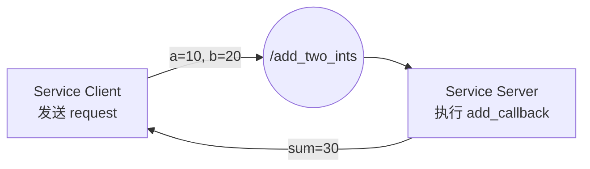

# ROS 2 通信机制——服务（Service）

## 1. Service 是什么

Service（服务）是 ROS 2 中的一种**请求—响应（Request–Response）**通信机制。

它的核心流程是：

```text
Client 发送 Request
        ↓
Server 收到 Request
        ↓
Server 执行 callback
        ↓
Server 填写 Response
        ↓
Client 收到 Response
```

可以把 Service 暂时理解成“跨节点调用函数”。例如普通 Python 函数：

```python
def add(a, b):
    return a + b
```

在 ROS 2 Service 中变成：

```text
Client：发送 a、b
Server：计算 a + b
Server：返回 sum
```

本次学习的例子是两个整数相加：

```text
/add_two_ints

request:
  a = 10
  b = 20

response:
  sum = 30
```



## 2. Service 和 Topic 的区别

| 对比项 | Topic | Service |
|---|---|---|
| 通信模型 | 发布—订阅 | 请求—响应 |
| 数据方向 | 通常单向 | 双向 |
| 是否要求返回值 | 不要求 | 要求返回 Response |
| 常见用途 | 连续数据流 | 一次性任务/查询/控制 |
| 典型例子 | 雷达、图像、速度、里程计 | 加法、开关、查询状态、触发动作 |

可以记成：

```text
Topic:
Publisher → Message → Subscriber

Service:
Client → Request → Server
Client ← Response ← Server
```

Topic 更像“广播消息”，Service 更像“调用函数并等待结果”。

## 3. `.srv` 文件的含义

Service 的数据结构由 `.srv` 接口定义。

本次使用的是 ROS 2 已经提供好的：

```python
from example_interfaces.srv import AddTwoInts
```

`AddTwoInts.srv` 的结构是：

```text
int64 a
int64 b
---
int64 sum
```

中间的 `---` 是分界线：

```text
--- 上面：Request，Client 发给 Server
--- 下面：Response，Server 返回给 Client
```

所以：

```text
AddTwoInts
├── Request
│   ├── a
│   └── b
└── Response
    └── sum
```

在 Python 中：

```python
request = AddTwoInts.Request()
request.a = 10
request.b = 20

# response 里面应该使用 sum
response.sum = request.a + request.b
```

> [!warning]
> `AddTwoInts.Response` 里字段叫 `sum`，不是 `num`。如果写成 `response.num`，语法检查可能不报错，但运行逻辑会出问题。

## 4. 工作空间和包结构

本次学习中使用的工作空间大致是：

```text
chapter2/
└── src/
    └── service_example/
        ├── package.xml
        ├── setup.py
        ├── setup.cfg
        ├── resource/
        ├── test/
        └── service_example/
            ├── __init__.py
            ├── service_server.py
            └── service_client.py
```

创建 Python 包时，在 `chapter2/src` 下执行：

```bash
ros2 pkg create --build-type ament_python service_example --dependencies rclpy example_interfaces
```

注意两层 `service_example` 的区别：

```text
chapter2/src/service_example
        ↑
        ROS 2 包目录，里面有 setup.py、package.xml

chapter2/src/service_example/service_example
        ↑
        真正放 Python 节点代码的 Python 包目录
```

所以 `service_server.py` 和 `service_client.py` 应该放在：

```text
chapter2/src/service_example/service_example/
```

## 5. Server 端代码结构

### 5.1 完整 Server 示例

```python
import rclpy
from rclpy.node import Node
from example_interfaces.srv import AddTwoInts


class AddTwoIntsServer(Node):

    def __init__(self):
        super().__init__('add_two_ints_server')

        self.srv = self.create_service(
            AddTwoInts,
            'add_two_ints',
            self.add_callback
        )

    def add_callback(self, request, response):
        response.sum = request.a + request.b
        return response


def main(args=None):
    rclpy.init(args=args)

    node = AddTwoIntsServer()

    rclpy.spin(node)

    node.destroy_node()
    rclpy.shutdown()


if __name__ == '__main__':
    main()
```

### 5.2 Server 最核心的一句

```python
self.srv = self.create_service(
    AddTwoInts,
    'add_two_ints',
    self.add_callback
)
```

这句话可以拆成：

```text
self.create_service(
    AddTwoInts,          # ① Service 类型
    'add_two_ints',      # ② Service 名字
    self.add_callback    # ③ 收到请求后执行的回调函数
)
```

含义是：

> 当前节点创建了一个名为 `add_two_ints` 的 Service，它使用 `AddTwoInts` 数据类型；一旦收到 Client 请求，就执行 `add_callback()`。

### 5.3 `self.srv` 是什么

```python
self.srv = self.create_service(...)
```

可以理解成：

```text
self
↓
当前 AddTwoIntsServer 节点对象

self.create_service(...)
↓
Node 提供的方法，用来创建 Service 对象

self.srv = ...
↓
把创建出的 Service 对象保存到当前节点的 srv 属性里
```

节点本身不是 Service 对象，而是节点创建并管理 Service 对象。

这和 Topic 里创建 Publisher、Subscription 的结构很像：

```python
self.publisher = self.create_publisher(...)
self.subscription = self.create_subscription(...)
self.srv = self.create_service(...)
```

## 6. callback 为什么会自动调用

Server 中的 callback：

```python
def add_callback(self, request, response):
    response.sum = request.a + request.b
    return response
```

不是自己突然运行，而是前面已经注册给 ROS 2：

```python
self.create_service(
    AddTwoInts,
    'add_two_ints',
    self.add_callback
)
```

这里第三个参数写的是：

```python
self.add_callback
```

注意：没有括号。

| 写法 | 含义 |
|---|---|
| `self.add_callback` | 把函数本身交给 ROS 2，等请求来了再调用 |
| `self.add_callback()` | 现在立刻执行这个函数 |

所以完整机制是：

```text
create_service()
        ↓
注册 callback
        ↓
rclpy.spin(node)
        ↓
持续等待 ROS 2 事件
        ↓
Client 发来 request
        ↓
Executor 调用 add_callback(request, response)
        ↓
return response
```

这和 Topic 的订阅 callback 是同一种思想。

## 7. `rclpy.spin(node)` 的理解

`rclpy.spin(node)` 的意思是：

> 让这个节点持续运行，并不断处理 ROS 2 中发生的事件。

可以粗略类比 STM32 里的：

```c
while (1)
{
    // 等待和处理各种事件
}
```

但 ROS 2 的 `spin()` 是由 Executor 帮你处理事件：

```text
rclpy.spin(node)
    ↓
有没有 Timer 到时间？
有没有 Topic 消息？
有没有 Service 请求？
    ↓
谁准备好了，就执行谁的 callback
```

所以：

```text
spin(node)
≈ ROS 2 帮你写好的“超级 while(1) 事件循环”
```

### 7.1 Server 为什么看起来“卡住”

Server 运行：

```bash
ros2 run service_example response
```

或者：

```bash
ros2 run service_example service_server
```

如果终端一直停着，没有回到命令提示符，这是正常的。

因为 Server 里面有：

```python
rclpy.spin(node)
```

它正在持续等待 Client 请求。

### 7.2 几种 spin 的区别

| 写法 | 含义 | 典型场景 |
|---|---|---|
| `rclpy.spin(node)` | 一直处理事件 | Server、Subscriber、周期性 Publisher |
| `rclpy.spin_once(node)` | 只处理一次事件 | 临时处理一次回调 |
| `rclpy.spin_until_future_complete(node, future)` | 处理事件直到某个 Future 完成 | Service Client 等一次响应 |

## 8. Client 端代码结构

### 8.1 完整 Client 示例

```python
import rclpy
from rclpy.node import Node
from example_interfaces.srv import AddTwoInts


class AddTwoIntsClient(Node):

    def __init__(self):
        super().__init__('add_two_ints_client')

        self.client = self.create_client(
            AddTwoInts,
            'add_two_ints'
        )

        while not self.client.wait_for_service(timeout_sec=1.0):
            self.get_logger().info('等待 add_two_ints service...')

    def send_request(self, a, b):
        request = AddTwoInts.Request()

        request.a = a
        request.b = b

        future = self.client.call_async(request)

        return future


def main(args=None):
    rclpy.init(args=args)

    node = AddTwoIntsClient()

    future = node.send_request(10, 20)

    rclpy.spin_until_future_complete(node, future)

    response = future.result()

    print(response.sum)

    node.destroy_node()
    rclpy.shutdown()


if __name__ == '__main__':
    main()
```

### 8.2 Client 创建服务对象

```python
self.client = self.create_client(
    AddTwoInts,
    'add_two_ints'
)
```

它和 Server 对应：

```text
Server                         Client
create_service()               create_client()
AddTwoInts                     AddTwoInts
add_two_ints                   add_two_ints
```

必须满足：

```text
Service 类型一致：AddTwoInts ↔ AddTwoInts
Service 名字一致：add_two_ints ↔ add_two_ints
```

### 8.3 为什么要 `wait_for_service()`

```python
while not self.client.wait_for_service(timeout_sec=1.0):
    self.get_logger().info('等待 add_two_ints service...')
```

作用是：

> Client 创建后，先等待它发现 Server，再发送 Request。

即使 Server 已经启动，刚创建出来的 Client 也可能需要一点时间通过 DDS discovery 发现对应 Service。

如果没有 `wait_for_service()`，可能出现：

```text
Client 创建
    ↓
立刻 call_async()
    ↓
此时还没有发现 Server
    ↓
future 一直等不到 response
```

加上以后流程变成：

```text
创建 Client
    ↓
wait_for_service()
    ↓
发现 /add_two_ints
    ↓
send_request()
    ↓
call_async()
    ↓
等待 response
```

## 9. Request、Future、Response

Service Client 中最容易混的是这三个对象。

```python
request = AddTwoInts.Request()
request.a = 10
request.b = 20

future = self.client.call_async(request)

rclpy.spin_until_future_complete(node, future)

response = future.result()
print(response.sum)
```

它们的区别：

| 对象 | 含义 |
|---|---|
| `request` | 准备发给 Server 的请求数据 |
| `future` | 异步请求的“未来结果对象” |
| `response` | Server 真正返回的数据 |

流程：

```text
Request
  ↓
call_async(request)
  ↓
马上返回 Future
  ↓
Server 处理请求
  ↓
Response 返回
  ↓
Future 变成完成状态
  ↓
future.result()
  ↓
拿到 Response
```

### 9.1 Future 在 response 没来时是什么

在 response 没回来时：

```python
future.done() == False
```

这时 `future` 不是 `None`，它已经是一个真实存在的 Future 对象，只是还没有完成。

可以理解成：

```text
Future
├── 状态：未完成
├── result：暂时没有
└── 等待 Response
```

当 response 回来后：

```python
future.done() == True
```

此时：

```text
Future
├── 状态：已完成
├── result：AddTwoInts.Response 对象
└── response.sum = 30
```

然后才能：

```python
response = future.result()
```

> [!note]
> `call_async(request)` 返回的不是最终答案，而是一个 Future。真正的 Response 要等 `spin_until_future_complete()` 之后再通过 `future.result()` 取出来。

## 10. `main()` 的运行流程

### 10.1 Server 的 main

```python
def main(args=None):
    rclpy.init(args=args)
    node = AddTwoIntsServer()
    rclpy.spin(node)
    node.destroy_node()
    rclpy.shutdown()
```

流程：

```text
rclpy.init()
    ↓
创建 Server 节点
    ↓
create_service() 注册服务和 callback
    ↓
rclpy.spin(node)
    ↓
一直等待 Request
    ↓
收到 Request 后执行 callback
    ↓
返回 Response
```

### 10.2 Client 的 main

```python
def main(args=None):
    rclpy.init(args=args)
    node = AddTwoIntsClient()
    future = node.send_request(10, 20)
    rclpy.spin_until_future_complete(node, future)
    response = future.result()
    print(response.sum)
    node.destroy_node()
    rclpy.shutdown()
```

流程：

```text
rclpy.init()
    ↓
创建 Client 节点
    ↓
等待发现 Service
    ↓
发送一次 Request
    ↓
等待 Future 完成
    ↓
取出 Response
    ↓
打印 sum
    ↓
程序退出
```

所以 Client 是一个“只运行一次”的节点：发送一次请求，收到一次响应，然后结束。

## 11. `setup.py`、Python 文件名、节点名、Service 名

这部分很容易混，要分清 5 个名字：

| 名字 | 由哪里决定 | 例子 | 作用 |
|---|---|---|---|
| 包名 | `ros2 pkg create` / `package.xml` | `service_example` | `ros2 run service_example ...` |
| Python 文件名 | 文件本身 | `service_client.py` | 存放代码 |
| 可执行程序名 | `setup.py` 的 `console_scripts` 左边 | `client` 或 `response` | `ros2 run` 最后一个参数 |
| 节点名 | `super().__init__('xxx')` | `add_two_ints_client` | `ros2 node list` 中看到的名字 |
| Service 名 | `create_service/create_client` 第二个参数 | `add_two_ints` | `ros2 service list` 中看到 `/add_two_ints` |

例如：

```python
entry_points={
    'console_scripts': [
        'response = service_example.service_server:main',
        'client = service_example.service_client:main',
    ],
},
```

这表示：

```bash
ros2 run service_example response
ros2 run service_example client
```

如果你写成：

```python
entry_points={
    'console_scripts': [
        'service_server = service_example.service_server:main',
        'service_client = service_example.service_client:main',
    ],
},
```

那运行命令就是：

```bash
ros2 run service_example service_server
ros2 run service_example service_client
```

> [!important]
> `ros2 run` 使用的是 `setup.py` 中 `console_scripts` 左边的名字，不是 `.py` 文件名。

## 12. 编译、source 和运行

### 12.1 编译位置

`colcon build` 一般在工作空间根目录执行，不是在 `src` 里面执行。

正确：

```bash
cd ~/chapter2
colcon build --packages-select service_example
```

不推荐：

```bash
cd ~/chapter2/src
colcon build
```

因为如果在 `src` 中 build，可能会把 `build/`、`install/`、`log/` 生成到 `src` 里面，目录会乱。

### 12.2 source 的作用

```bash
source install/setup.bash
```

作用是：

> 让当前终端认识 `chapter2/install` 中刚刚构建好的 ROS 2 包。

每开一个新终端，都要重新 source：

```bash
cd ~/chapter2
source install/setup.bash
```

如果不在 `~/chapter2` 目录，也可以写绝对路径：

```bash
source ~/chapter2/install/setup.bash
```

常见区别：

```text
setup.bash  → Bash 常用
setup.zsh   → Zsh 常用
setup.sh    → 通用 POSIX shell
```

### 12.3 运行顺序

终端 1：先启动 Server。

```bash
cd ~/chapter2
source install/setup.bash
ros2 run service_example response
```

终端 2：再启动 Client。

```bash
cd ~/chapter2
source install/setup.bash
ros2 run service_example client
```

正常现象：

```text
终端 1 Server：
ros2 run service_example response
█
一直停着，正常，因为正在 spin 等请求

终端 2 Client：
ros2 run service_example client
30
$
打印 30，然后程序退出
```

如果 Server 端没有写日志，Client 调用成功后 Server 终端也可能看起来什么都没显示。

可以在 Server callback 中加日志：

```python
def add_callback(self, request, response):
    response.sum = request.a + request.b
    self.get_logger().info(
        f'收到请求: {request.a} + {request.b} = {response.sum}'
    )
    return response
```

## 13. 常用调试命令

### 13.1 查看 Service

```bash
ros2 service list
```

正常应该能看到：

```text
/add_two_ints
```

查看类型：

```bash
ros2 service type /add_two_ints
```

应该是：

```text
example_interfaces/srv/AddTwoInts
```

### 13.2 命令行直接调用 Service

不用自己写 Client，也可以直接测试 Server：

```bash
ros2 service call /add_two_ints example_interfaces/srv/AddTwoInts "{a: 10, b: 20}"
```

正常返回：

```text
response:
example_interfaces.srv.AddTwoInts_Response(sum=30)
```

或者显示类似：

```text
sum: 30
```

如果这个命令能返回 30，说明：

```text
Server 正常
Service 名正常
AddTwoInts 类型正常
callback 正常
Request/Response 正常
```

如果手写 Client 仍然卡住，重点检查 Client 代码。

### 13.3 查看包里有哪些可执行程序

```bash
ros2 pkg executables service_example
```

它能告诉你 `ros2 run service_example ...` 后面到底应该写什么。

### 13.4 检查 Python 语法

在 Python 文件所在目录：

```bash
python3 -m py_compile service_server.py
python3 -m py_compile service_client.py
```

如果没有输出，通常说明 Python 语法通过。

但它只能检查语法，不代表 ROS 2 逻辑完全正确。

例如下面这种拼写错误，`py_compile` 不一定能发现：

```python
self.creat_client(...)
```

真正运行才会报：

```text
AttributeError: object has no attribute 'creat_client'
```

## 14. 常见问题和排查

### 14.1 Server 一直卡着是不是错了

不是。Server 有：

```python
rclpy.spin(node)
```

所以它本来就应该一直运行，等待请求。

### 14.2 Client 一直卡着可能是什么原因

可能原因：

1. Server 没启动；
2. Client 没有 `wait_for_service()`，还没发现 Server 就发请求；
3. Server 和 Client 的 Service 名不一致；
4. Server 和 Client 的 Service 类型不一致；
5. Server callback 没有正确 `return response`；
6. Response 字段写错，比如写成 `response.num` 而不是 `response.sum`；
7. DDS discovery 或 ROS 2 daemon 卡住；
8. 两个终端的 `ROS_DOMAIN_ID` 不一致。

### 14.3 `No executable found`

说明 `ros2 run` 后面的可执行程序名不对。

检查：

```bash
ros2 pkg executables service_example
```

或者查看 `setup.py`：

```python
entry_points={
    'console_scripts': [
        'client = service_example.service_client:main',
    ],
},
```

如果左边是 `client`，就应该运行：

```bash
ros2 run service_example client
```

不是：

```bash
ros2 run service_example service_client
```

### 14.4 `ModuleNotFoundError`

例如：

```text
ModuleNotFoundError: No module named 'service_example.service'
```

通常是 `setup.py` 冒号左边的模块路径写错了。

如果文件名是：

```text
service_server.py
```

那么应该写：

```python
'response = service_example.service_server:main'
```

不要写成：

```python
'response = service_example.service:main'
```

### 14.5 `creat_client` / `creat_service` 拼错

错误写法：

```python
self.creat_client(...)
self.creat_service(...)
```

正确写法：

```python
self.create_client(...)
self.create_service(...)
```

少一个 `e` 会导致运行时报 `AttributeError`。

### 14.6 `ros2 service list` 卡住

可能是 ROS 2 CLI daemon / DDS discovery 卡住。

可以重启 daemon：

```bash
ros2 daemon stop
ros2 daemon start
ros2 daemon status
```

如果 `ros2 daemon stop` 本身也卡住，可以按 `Ctrl + C`，再尝试：

```bash
pkill -f ros2-daemon
ros2 daemon start
```

还可以检查两个终端的通信域是否一致：

```bash
echo $ROS_DOMAIN_ID
```

两个终端应该相同，比如都为空，或者都是 `0`。

## 15. 本次最终跑通的现象

最终运行流程：

```text
Server
ros2 run service_example response
↓
一直 spin 等待请求

Client
ros2 run service_example client
↓
发送 request
↓
收到 response
↓
打印结果
↓
程序退出
```

如果 Client 打印：

```text
30
```

并重新回到命令提示符，说明：

```text
Request 发送成功 ✅
Server callback 被调用 ✅
Response 返回成功 ✅
Future 完成 ✅
Client 正常结束 ✅
```

## 16. 一句话总结

```text
Service = Client 发 Request，Server 执行 callback 后返回 Response。
```

最核心代码：

```python
# Server
self.srv = self.create_service(
    AddTwoInts,
    'add_two_ints',
    self.add_callback
)

# Client
self.client = self.create_client(
    AddTwoInts,
    'add_two_ints'
)

request = AddTwoInts.Request()
request.a = 10
request.b = 20

future = self.client.call_async(request)
rclpy.spin_until_future_complete(node, future)
response = future.result()
print(response.sum)
```

最终要记住：

```text
Server：create_service → callback(request, response) → return response
Client：create_client → Request → call_async → Future → future.result → Response
驱动：spin / spin_until_future_complete
条件：Service 名相同 + Service 类型相同 + Server 正在运行
```

## 参考资料

- [ROS 2 官方教程：Writing a simple service and client - Python](https://docs.ros.org/en/rolling/Tutorials/Beginner-Client-Libraries/Writing-A-Simple-Py-Service-And-Client.html)
- [ROS 2 官方文档：Services](https://docs.ros.org/en/rolling/Concepts/Basic/About-Services.html)
