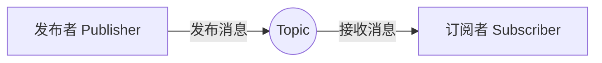

# ROS 2 通信机制——话题（Topic）

## 1. Topic 是什么

Topic（话题）是 ROS 2 中最常用的通信机制之一，采用**发布—订阅（Publish–Subscribe）**模型，主要用于传输连续产生的数据，例如：

- 激光雷达数据；
- 相机图像；
- 机器人速度；
- 里程计和传感器状态。

发布者只负责发送消息，订阅者只负责接收消息，双方不需要直接知道彼此的信息。



## 2. Topic 的组成

一次完整的话题通信包含以下部分：

| 组成 | 作用 |
|---|---|
| Publisher | 向话题发布消息 |
| Subscriber | 订阅话题并接收消息 |
| Topic Name | 标识消息传输通道 |
| Message Type | 规定消息的数据结构 |
| QoS | 控制消息的可靠性和缓存方式 |

例如：

```text
Publisher  →  /cmd_vel  →  Subscriber
                │
                └── geometry_msgs/msg/Twist
```

## 3. Topic 的特点

### 3.1 异步通信

发布者发送消息后不等待订阅者返回结果。

### 3.2 单向传输

消息方向为：

```text
Publisher → Topic → Subscriber
```

### 3.3 多对多通信

一个话题可以同时存在多个发布者和多个订阅者。

### 3.4 发布者和订阅者解耦

发布者不需要知道订阅者是谁，订阅者也不需要知道发布者是谁。只要双方的话题名称、消息类型和 QoS 兼容，就可以进行通信。

## 4. 话题名称与消息类型

### 4.1 话题名称

常见话题名称：

```text
/cmd_vel
/scan
/odom
/camera/image_raw
```

话题名称区分大小写，并且通常使用 `/` 表示命名空间层级。

### 4.2 消息类型

Topic 传输的是强类型消息。常见消息类型如下：

| 消息类型 | 用途 |
|---|---|
| `std_msgs/msg/String` | 字符串消息 |
| `geometry_msgs/msg/Twist` | 线速度和角速度 |
| `sensor_msgs/msg/LaserScan` | 激光雷达数据 |
| `sensor_msgs/msg/Image` | 图像数据 |
| `nav_msgs/msg/Odometry` | 里程计数据 |

同一个话题的发布者和订阅者必须使用相同的消息类型。

## 5. QoS

QoS（Quality of Service）用于控制 Topic 消息的传输方式。初学阶段重点掌握：

| QoS 参数 | 含义 |
|---|---|
| Depth | 消息队列的最大长度 |
| Reliable | 尽可能保证消息送达 |
| Best Effort | 尽力发送，允许少量消息丢失 |

```python
# 队列最多保存 10 条消息
publisher = node.create_publisher(String, 'chatter', 10)
```

> [!warning]
> 发布者和订阅者的 QoS 不兼容时，即使话题名称和消息类型相同，也可能收不到消息。

## 6. 常用命令

```bash
# 查看所有话题
ros2 topic list

# 查看话题及消息类型
ros2 topic list -t

# 查看话题信息和 QoS
ros2 topic info /cmd_vel --verbose

# 查看话题中的消息
ros2 topic echo /cmd_vel

# 查看消息结构
ros2 interface show geometry_msgs/msg/Twist

# 查看发布频率
ros2 topic hz /cmd_vel
```

手动发布一条消息：

```bash
ros2 topic pub --once /chatter std_msgs/msg/String "{data: 'hello ROS 2'}"
```

## 7. Python 最小示例

### 发布者

```python
from std_msgs.msg import String

publisher = node.create_publisher(String, 'chatter', 10)

msg = String()
msg.data = 'hello ROS 2'
publisher.publish(msg)
```

### 订阅者

```python
from std_msgs.msg import String

def callback(msg):
    print(msg.data)

subscription = node.create_subscription(
    String, 'chatter', callback, 10
)
```

## 8. 通信成功的条件

1. 话题名称相同；
2. 消息类型相同；
3. QoS 配置兼容；
4. 发布者和订阅者均已正常运行。

## 9. 总结

```text
Topic = 异步发布订阅通信

Publisher → Topic → Subscriber

特点：异步、单向、多对多、通信双方解耦

通信条件：话题名相同 + 消息类型相同 + QoS 兼容
```

## 参考资料

- [ROS 2 官方文档：Topics](https://docs.ros.org/en/rolling/Concepts/Basic/About-Topics.html)
- [ROS 2 官方教程：Understanding topics](https://docs.ros.org/en/lyrical/Tutorials/Beginner-CLI-Tools/Understanding-ROS2-Topics/Understanding-ROS2-Topics.html)
