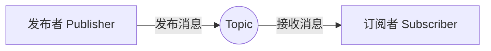

# ROS 2 通信机制——话题（Topic）

## 1. Topic 是什么

Topic（话题）是 ROS 2 中最常用的通信机制之一，采用**发布—订阅（Publish–Subscribe）**模型，主要用于传输连续产生的数据，例如：

- 激光雷达数据；
- 相机图像；
- 机器人速度；
- 里程计和传感器状态。

发布者只负责发送消息，订阅者只负责接收消息，双方不需要直接知道彼此的信息。



## 2. Topic 的组成

一次完整的话题通信包含以下部分：

| 组成 | 作用 |
|---|---|
| Publisher | 向话题发布消息 |
| Subscriber | 订阅话题并接收消息 |
| Topic Name | 标识消息传输通道 |
| Message Type | 规定消息的数据结构 |
| QoS | 控制消息的可靠性和缓存方式 |

例如：

```text
Publisher  →  /cmd_vel  →  Subscriber
                │
                └── geometry_msgs/msg/Twist
```

### Node、Publisher 和 Subscription 的关系

`Node` 是功能主体，Publisher 和 Subscription 是 Node 创建并管理的通信对象：

```text
Node
├── Publisher
├── Subscription
├── Subscription
└── Timer
```

因此：

- Node 不等于 Publisher；
- Node 也不等于 Subscriber；
- 一个 Node 可以创建多个 Publisher 和多个 Subscription；
- 同一个 Node 可以一边订阅消息，一边发布消息。

Python 中：

```python
self.subscription = self.create_subscription(...)
```

应拆成两部分理解：

```text
self.create_subscription(...)
        当前 Node 调用继承来的方法，创建 Subscription 对象

self.subscription = ...
        把创建出的对象保存在当前 Node 的属性中
```

`create_subscription()` 是 `Node` 提供的方法；`subscription` 是自己定义的属性名，可以改成 `sub`、`scan_sub` 等其他名称。

## 3. Topic 的特点

### 3.1 异步通信

发布者发送消息后不等待订阅者返回结果。

### 3.2 单向传输

消息方向为：

```text
Publisher → Topic → Subscriber
```

### 3.3 多对多通信

一个话题可以同时存在多个发布者和多个订阅者。

### 3.4 发布者和订阅者解耦

发布者不需要知道订阅者是谁，订阅者也不需要知道发布者是谁。只要双方的话题名称、消息类型和 QoS 兼容，就可以进行通信。

## 4. 话题名称与消息类型

### 4.1 话题名称

常见话题名称：

```text
/cmd_vel
/scan
/odom
/camera/image_raw
```

话题名称区分大小写，并且通常使用 `/` 表示命名空间层级。

### 4.2 消息类型

Topic 传输的是强类型消息。常见消息类型如下：

| 消息类型 | 用途 |
|---|---|
| `std_msgs/msg/String` | 字符串消息 |
| `geometry_msgs/msg/Twist` | 线速度和角速度 |
| `sensor_msgs/msg/LaserScan` | 激光雷达数据 |
| `sensor_msgs/msg/Image` | 图像数据 |
| `nav_msgs/msg/Odometry` | 里程计数据 |

同一个话题的发布者和订阅者必须使用相同的消息类型。

## 5. QoS

QoS（Quality of Service）用于控制 Topic 消息的传输方式。初学阶段重点掌握：

| QoS 参数 | 含义 |
|---|---|
| Depth | 消息队列的最大长度 |
| Reliable | 尽可能保证消息送达 |
| Best Effort | 尽力发送，允许少量消息丢失 |

```python
# 队列最多保存 10 条消息
publisher = node.create_publisher(String, 'chatter', 10)
```

> [!warning]
> 发布者和订阅者的 QoS 不兼容时，即使话题名称和消息类型相同，也可能收不到消息。

## 6. Publisher 与 Subscriber 的运行过程

### 6.1 创建和发送不是一回事

```python
# 创建 Publisher 对象
self.publisher = self.create_publisher(
    String, 'topic', 10
)

# 真正发送消息
self.publisher.publish(msg)
```

同理：

```python
# 创建 Subscription，并注册回调函数
self.subscription = self.create_subscription(
    String,
    'topic',
    self.listener_callback,
    10
)
```

最核心的对应关系：

```text
创建通信对象：
create_publisher()       ←→       create_subscription()

实际通信：
publisher.publish(msg)   ───→     callback(msg)
       发送                         接收并处理
```

### 6.2 `create_subscription()` 的四个参数

```python
self.subscription = self.create_subscription(
    String,                  # ① 消息类型
    'topic',                 # ② 话题名称
    self.listener_callback,  # ③ 收到消息后执行的函数
    10                       # ④ QoS 队列深度
)
```

这段代码可以翻译为：

> 当前 Node 创建一个 Subscription，订阅 `topic` 上的 `String` 消息；收到消息后执行 `listener_callback`，队列深度为 10。

### 6.3 为什么 callback 不加括号

注册回调时写：

```python
self.listener_callback
```

而不是：

```python
self.listener_callback()
```

二者的区别：

- `self.listener_callback`：把**函数本身**交给 ROS 2，稍后收到消息时再调用；
- `self.listener_callback()`：现在立即执行函数。

### 6.4 Subscriber 为什么没有 `receive()`

ROS 2 的订阅采用事件驱动和回调机制。Subscriber 不需要主动调用 `receive()`，而是先注册 callback，再通过 `spin()` 持续处理事件：

```text
rclpy.spin(node)
       ↓
等待 Topic 消息
       ↓
收到消息
       ↓
ROS 2 自动调用 callback(msg)
       ↓
继续等待
```

### 6.5 callback 中的 `msg` 从哪里来

```python
def listener_callback(self, msg):
    print(msg.data)
```

`msg` 不需要自己创建。它是 ROS 2 收到消息后，调用 callback 时自动传入的消息对象。

```text
Publisher 创建 msg
        ↓
publisher.publish(msg)
        ↓
Topic
        ↓
ROS 2 调用 listener_callback(msg)
        ↓
Subscriber 读取 msg.data
```

消息对象有哪些字段由消息类型决定：

```python
# std_msgs/msg/String
msg.data

# geometry_msgs/msg/Twist
msg.linear.x
msg.angular.z
```

## 7. 常用命令

```bash
# 查看所有话题
ros2 topic list

# 查看话题及消息类型
ros2 topic list -t

# 查看话题信息和 QoS
ros2 topic info /cmd_vel --verbose

# 查看话题中的消息
ros2 topic echo /cmd_vel

# 查看消息结构
ros2 interface show geometry_msgs/msg/Twist

# 查看发布频率
ros2 topic hz /cmd_vel
```

手动发布一条消息：

```bash
ros2 topic pub --once /chatter std_msgs/msg/String "{data: 'hello ROS 2'}"
```

## 8. Python 完整示例

### 8.1 发布者

```python
import rclpy
from rclpy.node import Node
from std_msgs.msg import String


class MinimalPublisher(Node):
    def __init__(self):
        super().__init__('minimal_publisher')

        self.publisher = self.create_publisher(
            String, 'topic', 10
        )

        self.timer = self.create_timer(
            1.0, self.timer_callback
        )

    def timer_callback(self):
        msg = String()
        msg.data = 'hello ROS 2'
        self.publisher.publish(msg)


def main(args=None):
    rclpy.init(args=args)
    node = MinimalPublisher()
    rclpy.spin(node)
    node.destroy_node()
    rclpy.shutdown()


if __name__ == '__main__':
    main()
```

`timer_callback()` 决定“每隔一秒准备一次消息”，真正发送消息的仍然是：

```python
self.publisher.publish(msg)
```

### 8.2 订阅者

```python
import rclpy
from rclpy.node import Node
from std_msgs.msg import String


class MinimalSubscriber(Node):
    def __init__(self):
        # 调用父类 Node 的构造函数，将当前对象初始化为 ROS 2 节点
        super().__init__('minimal_subscriber')

        self.subscription = self.create_subscription(
            String,
            'topic',
            self.listener_callback,
            10
        )

    def listener_callback(self, msg):
        self.get_logger().info(
            '收到: %s' % msg.data
        )


def main(args=None):
    rclpy.init(args=args)
    node = MinimalSubscriber()
    rclpy.spin(node)
    node.destroy_node()
    rclpy.shutdown()


if __name__ == '__main__':
    main()
```

### 8.3 `self`、继承与构造函数

```python
class MinimalSubscriber(Node):
    def __init__(self):
        super().__init__('minimal_subscriber')
```

- `MinimalSubscriber(Node)`：表示 `MinimalSubscriber` 是一种 Node；
- `self`：当前这个 `MinimalSubscriber` 节点对象；
- `super().__init__(...)`：调用父类 `Node` 的构造函数；
- `'minimal_subscriber'`：节点名称；
- `create_subscription()`、`create_publisher()`、`get_logger()`：从 Node 继承来的能力。

`super().__init__()` 不是另外创建一个 Node，而是初始化当前对象中属于 Node 的部分。

### 8.4 `main()` 的运行流程

```text
rclpy.init(args=args)       初始化 ROS 2
        ↓
MinimalSubscriber()        创建节点，并执行 __init__()
        ↓
rclpy.spin(node)            持续等待消息并执行 callback
        ↓
node.destroy_node()         销毁节点
        ↓
rclpy.shutdown()            关闭 ROS 2
```

`spin()` 长时间停留并不是程序卡死，而是节点正在等待和处理消息。

### 8.5 `args=args` 是什么意思

```python
def main(args=None):
    rclpy.init(args=args)
```

- 右边的 `args`：`main()` 接收到的命令行参数变量；
- 左边的 `args=`：`rclpy.init()` 的参数名称；
- 整句话：把程序启动参数交给 ROS 2 进行初始化和解析。

`args` 是程序启动参数，与 Topic callback 中的 `msg` 不是同一个概念：

```text
args → 程序启动时的命令行参数
msg  → Topic 中传输的消息对象
```

### 8.6 一个 Node 可以创建多个订阅

```python
from geometry_msgs.msg import Twist
from sensor_msgs.msg import Imu, LaserScan


class RobotNode(Node):
    def __init__(self):
        super().__init__('robot_node')

        self.scan_sub = self.create_subscription(
            LaserScan, '/scan', self.scan_callback, 10
        )

        self.imu_sub = self.create_subscription(
            Imu, '/imu', self.imu_callback, 10
        )

        self.cmd_pub = self.create_publisher(
            Twist, '/cmd_vel', 10
        )
```

这里的所有 `self` 都是同一个 `RobotNode`，但 `scan_sub`、`imu_sub` 和 `cmd_pub` 是三个不同的通信对象。

## 9. 通信成功的条件

1. 话题名称相同；
2. 消息类型相同；
3. QoS 配置兼容；
4. 发布者和订阅者均已正常运行。

## 10. 易错点总结

- `Node` 是功能主体，Publisher 和 Subscription 是它管理的通信对象；
- `self.subscription` 是自定义属性，不是 Node 固定自带的属性名；
- `create_subscription()` 是创建并注册订阅，不是立即接收消息；
- `publish(msg)` 才是真正发送消息；
- Subscriber 没有主动 `receive()`，消息由 callback 接收和处理；
- 注册 callback 时传 `self.listener_callback`，不要加括号；
- callback 中的 `msg` 由 ROS 2 自动传入；
- 一个 Node 可以拥有多个 Publisher 和 Subscription；
- 没有 `spin()`，节点通常无法持续等待消息并执行 callback；
- `args` 是启动参数，`msg` 是 Topic 消息，不要混淆。

## 11. 总结

```text
Topic = 异步发布订阅通信

Publisher → Topic → Subscriber

创建：create_publisher() ←→ create_subscription()

通信：publish(msg) → callback(msg)

驱动：rclpy.spin(node)

通信条件：话题名相同 + 消息类型相同 + QoS 兼容
```

## 参考资料

- [ROS 2 官方文档：Topics](https://docs.ros.org/en/rolling/Concepts/Basic/About-Topics.html)
- [ROS 2 官方教程：Understanding topics](https://docs.ros.org/en/lyrical/Tutorials/Beginner-CLI-Tools/Understanding-ROS2-Topics/Understanding-ROS2-Topics.html)
